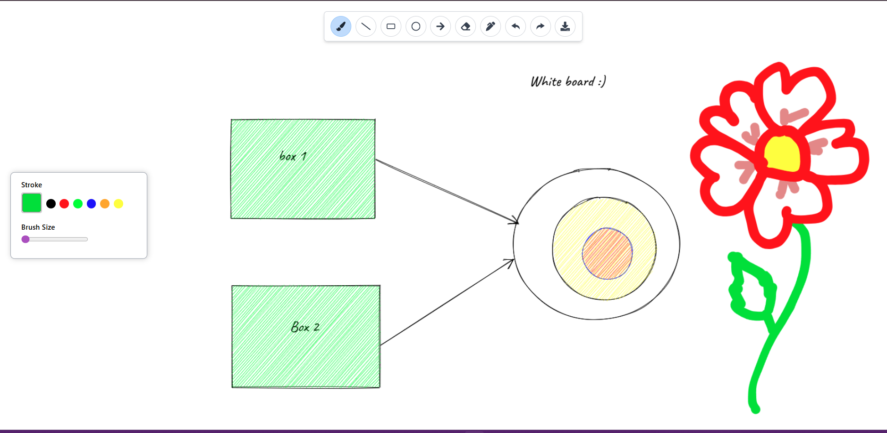

# 🧠 Whiteboard App

An interactive, browser-based whiteboard built with **React**, **Canvas API**, and **Rough.js**.  
Draw, annotate, and export your creations — all directly in the browser.  

[](https://white-board-rosy.vercel.app/)

---

## 🎥 Demo

  
*Tool selection, drawing shapes, changing colors, and exporting the final image.*

---

## 🖼 Screenshot



---

## ✨ Features

- 🖊 **Freehand Drawing** — Pen and brush tools for smooth sketching  
- 📏 **Shape Tools** — Rectangle, circle, and arrow with Rough.js for a natural, hand-drawn look  
- 🔤 **Text Annotations** — Place text anywhere on the canvas  
- 🎨 **Custom Styling** — Full color palette and stroke size control  
- 🧹 **Eraser Tool** — Remove specific parts of the drawing  
- ↩️ **Undo & Redo** — Available via buttons or keyboard shortcuts  
- 💾 **Export** — Save your board as a high-quality PNG image

---

## 🛠 Tech Stack

| Tech | Purpose |
|------|---------|
| **React** | Frontend framework |
| **HTML5 Canvas API** | Drawing logic |
| **Rough.js** | Hand-drawn style for shapes |
| **Tailwind CSS** | Styling |
| **Vercel** | Deployment |

---

## 🛣 Roadmap

- [ ] User authentication (JWT/Auth0)  
- [ ] Multi-user collaboration (WebSockets)  
- [ ] Real-time chat alongside drawing  
- [ ] AI features: sketch recognition, “Imagine this” generation  
- [ ] Save/load boards from a database  

---

## 📦 Run Locally

```bash
git clone https://github.com/Praphul12/WhiteBoard.git
cd WhiteBoard
npm install
npm start
