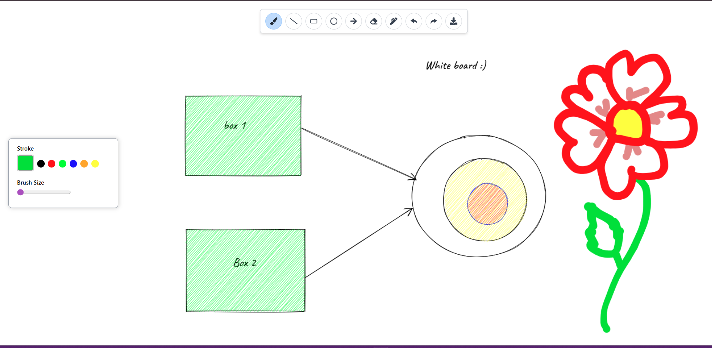

# 🎨 Whiteboard App

An interactive, browser-based whiteboard built with **React** & **Canvas API**.  
Draw, annotate, and export your creations — all directly in the browser.  

[](https://white-board-rosy.vercel.app)

---

## 🎥 Demo

  
*Tool selection, drawing shapes, changing colors, and exporting the final image.*

---

## 🖼 Screenshot



---

## ✨ Features

- 🖊 Freehand drawing (pen, brush)
- 📏 Shape tools: rectangle, circle, arrow
- 🔤 Text input anywhere on the board
- 🎨 Color palette & stroke size control
- 💾 Export canvas as PNG
- 🧹 Eraser & clear board *(if included)*

---

## 🛠 Tech Stack

| Tech | Purpose |
|------|---------|
| **React** | Frontend framework |
| **HTML5 Canvas API** | Drawing logic |
| **Tailwind CSS** | Styling |
| **Vercel** | Deployment |

---

## 🛣 Roadmap

- [ ] User authentication (JWT/Auth0)
- [ ] Multi-user collaboration (WebSockets)
- [ ] Real-time chat alongside drawing
- [ ] AI features: sketch recognition, “Imagine this” generation
- [ ] Save/load boards from a database

---

## 📦 Run Locally

```bash
git clone https://github.com/YOURUSERNAME/WhiteBoard.git
cd WhiteBoard
npm install
npm start
